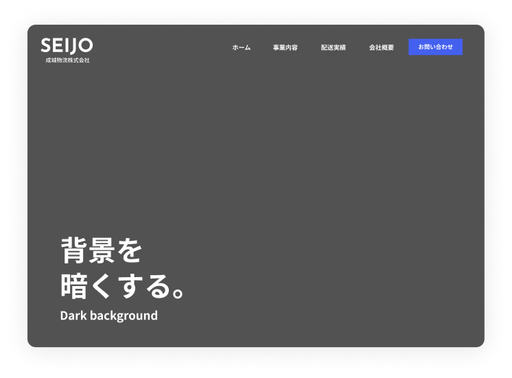
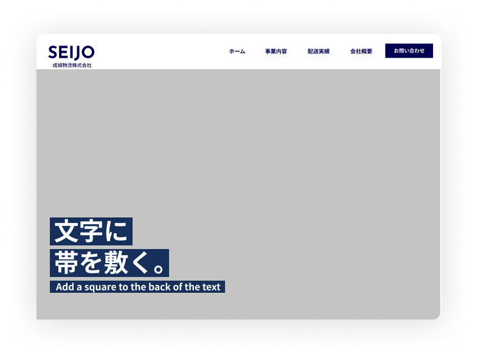
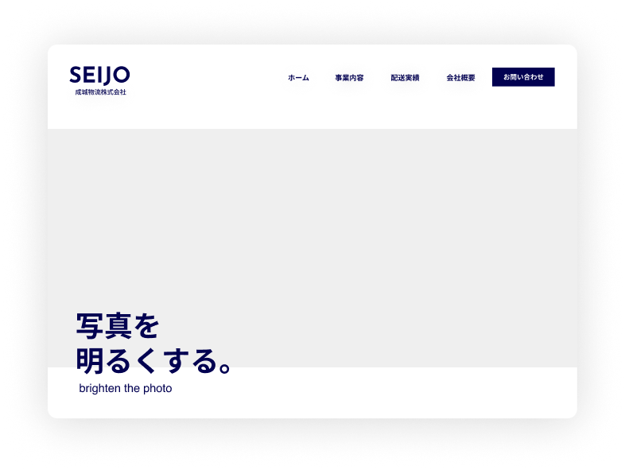
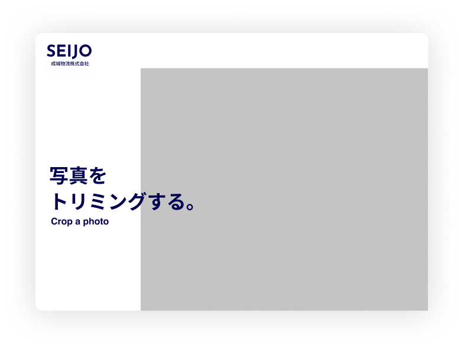
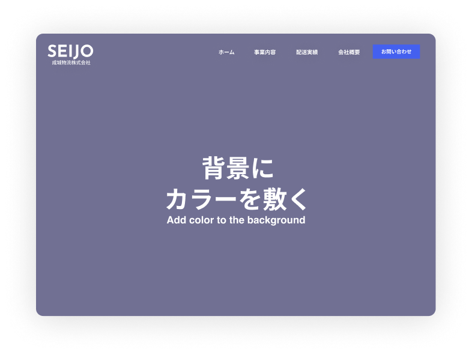
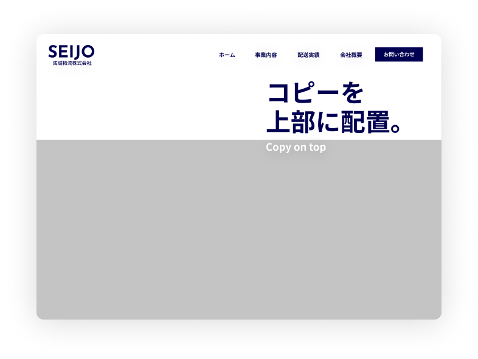

# キャッチコピーを読みやすくするFVのレイアウト6選

「なんか読みにくいな…」サイトの顔でもあるファーストビュー。
キャッチコピーが読みにくいのは致命的です。

ファーストビューで最も多く使用されるパターンとして、「写真＋文字」の組み合わせがあげられます。
写真と文字の両方から意図を伝えることができる汎用性の高い型です。

実際に制作をしていても、この組み合わせが多く用いられます。
しかし、写真の明るさや構図によって、文字の色・位置などを細かく調整する必要があるため、視認性を高く保つための技術が必要になります。

ここでは、キャッチコピーを読みやすくするファーストビューのデザインパターンを6つ紹介します。
写真と文字の両方を見やすくするために、ぜひお試しください。

---

## 01. 背景を暗くする

写真を暗くすることでコピーとの明暗がはっきりし、視認性が上がります。
白文字を使用すると抜け感も出せます。どんな写真にも汎用性が効く便利な方法です。

## 02. 文字に帯を敷く

帯を敷くことで、背景や写真がどのような状態でも文字が見えるようにすることができ、応用が利く便利な方法です。
サイトで使用されている色を使うと統一感も出せます。

## 03. 写真を明るくする

写真を明るく加工することで、文字と重なっても読みにくくならないように工夫します。
明るすぎると白飛びしてしまうので注意が必要ですが、そういったときは文字の下に白を敷くなどして視認性を確保します。

## 04. 写真をトリミングする

写真をトリミングして左端（または適切な場所）に余白を作ることで、コピー部分を読みやすくします。
あえて写真を全画面使わずに、コピーを目立たせる手法です。

## 05. 背景にカラーを敷く

サイト配色に合わせたカラーを写真に敷くことで、サイト全体の統一感にも繋がり、読みやすさも確保できる便利技です。
色が濃すぎないように注意が必要です。

## 06. コピーを上部に配置

コピーの位置を上部に配置し、写真を下にすることで、スマホで見た際も崩れることなく視認性を上げられます。
縦書きのキャッチコピーにも使用しやすく、配置によって使い分けられる便利な方法です。

---

ファーストビューでは鉄板の「文字＋写真」の組み合わせ。
コピーが読めないのはアウトなので、いろんなパターンに対応できるよう引き出しとして持っておくと便利です。

> 出典: Webデザイナーのふじわら｜Elementorでホームページ制作 (@fujiwara_web) - 2025年10月14日
